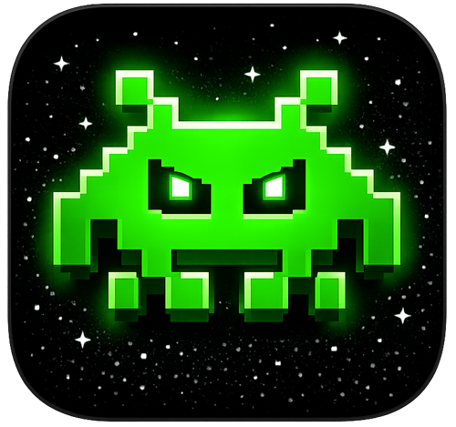
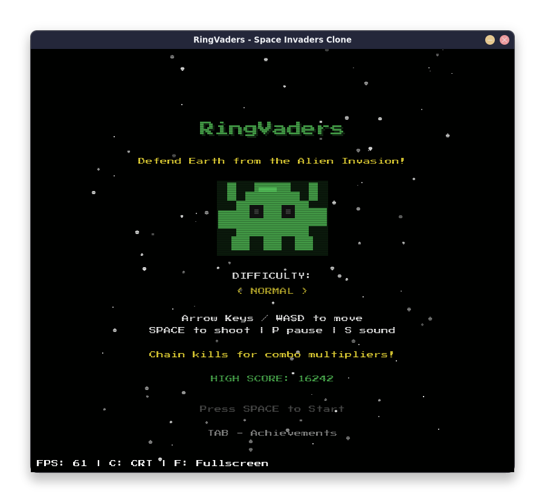
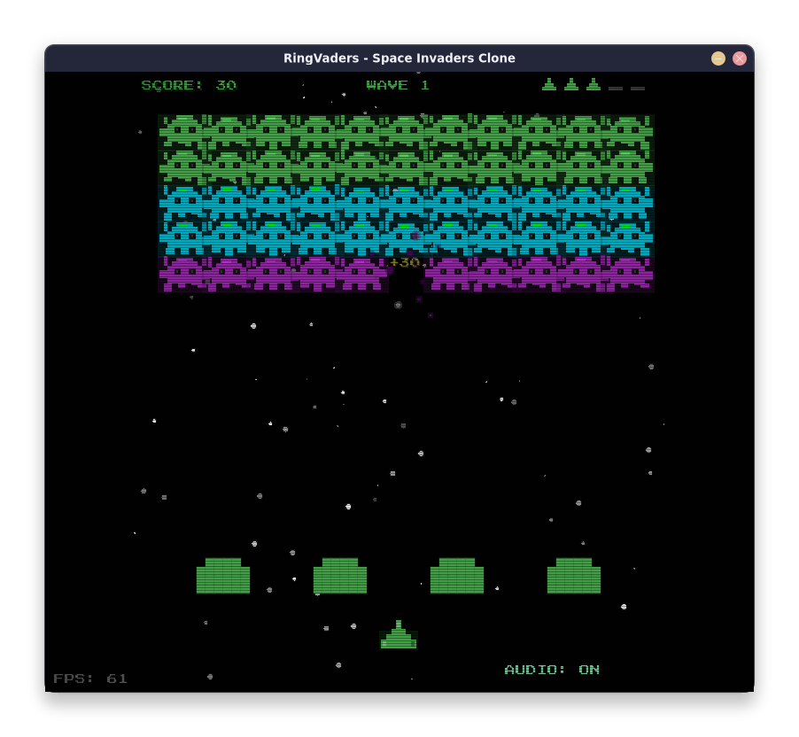
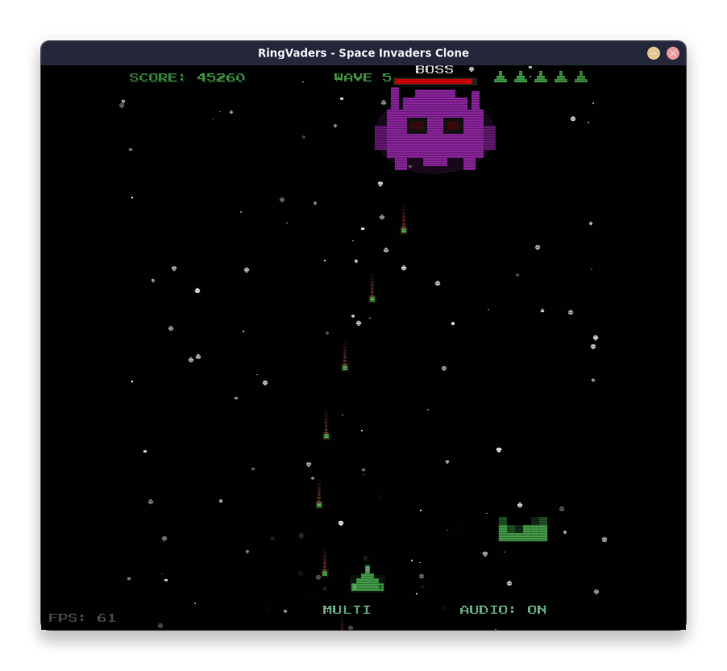
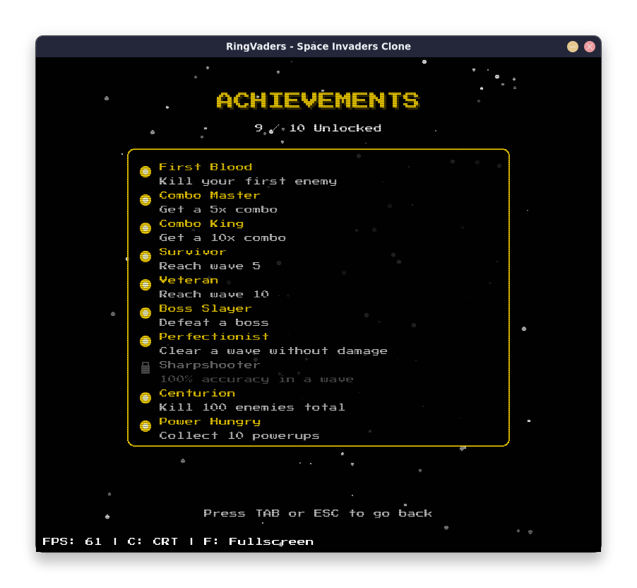

<div align="center">



# RingVaders

**A retro arcade shooter written in Ring using Ring Allegro. A clone of the classic Space Invaders.**

[language-ring]: https://img.shields.io/badge/language-Ring-2D54CB.svg?style=for-the-badge&labelColor=414868
[license]: https://img.shields.io/github/license/ysdragon/RingVaders?style=for-the-badge&logo=opensourcehardware&label=License&logoColor=C0CAF5&labelColor=414868&color=8c73cc
[releases]: https://img.shields.io/github/v/release/ysdragon/RingVaders?style=for-the-badge&labelColor=414868&color=56d364
[build]: https://img.shields.io/github/actions/workflow/status/ysdragon/RingVaders/release.yml?style=for-the-badge&labelColor=414868

[![][language-ring]](https://ring-lang.github.io/)
[![][license]](https://github.com/ysdragon/RingVaders/blob/main/LICENSE)
[![][releases]](https://github.com/ysdragon/RingVaders/releases/latest)
[![][build]](https://github.com/ysdragon/RingVaders/actions)

</div>

## Features

- Classic Space Invaders gameplay with modern effects
- Parallax starfield background
- Boss battles every 5 waves
- Powerup system (Shield, Rapid Fire, Multi-shot, Spread, Extra Life)
- Combo system with score multipliers
- 3 difficulty levels (Easy, Normal, Hard)
- Achievement system
- Dynamic music (Menu, Gameplay, Boss themes)
- CRT scanline effect (toggleable)
- Fullscreen support

## Controls

| Key | Action |
|-----|--------|
| `Arrow Keys` / `WASD` | Move |
| `Space` | Shoot |
| `P` | Pause |
| `S` | Toggle Sound/Music |
| `C` | Toggle CRT Effect |
| `F` | Toggle Fullscreen |
| `Tab` | View Achievements |
| `Esc` | Menu / Quit |

## Requirements

- [Ring Programming Language](https://ring-lang.github.io/) (1.24+)

## Installation

### Using Ring Package Manager (**RingPM**)

```shell
ringpm install RingVaders from ysdragon

# You can then run the game with:
ringpm run RingVaders
```

### Download from Releases

Download the latest release for your platform from the [Releases page](https://github.com/ysdragon/RingVaders/releases/latest):

| Platform | Formats |
|----------|---------|
| **Windows** | `.zip` (x64, x86) |
| **macOS** | `.dmg`, `.zip` (Intel, Apple Silicon) |
| **Linux** | `.deb`, `.rpm`, `.tar.gz` (amd64, arm64) |

## Screenshots

| | | |
|:---:|:---:|:---:|
|  |  |
|  |  |

## License

This project is licensed under the MIT License - see the [LICENSE](LICENSE) file for details.